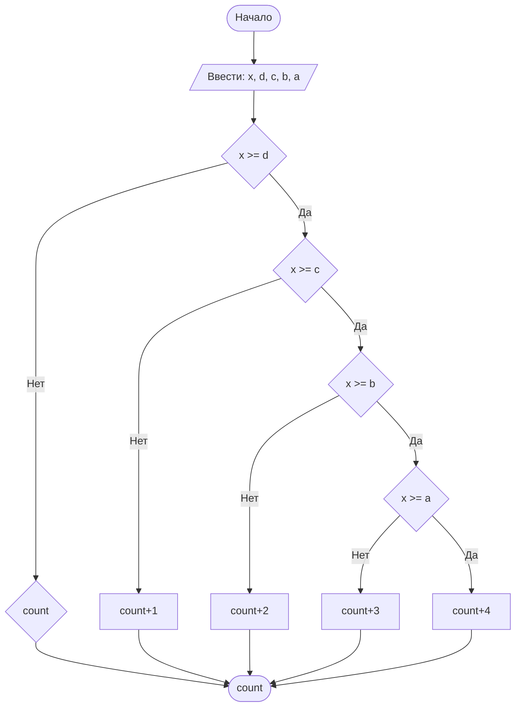

## Cодержание

## Отчет по лабораторной работе № 1

#### № группы: `ПМ-2502`

#### Выполнил: `Янцеловский Виталий Станиславович`

#### Вариант: `25`

### Cодержание:

- [Постановка задачи](#1-постановка-задачи)
- [Входные и выходные данные](#2-входные-и-выходные-данные)
- [Математическая модель](#25-математическая-модель)
- [Выбор структуры данных](#3-выбор-структуры-данных)
- [Алгоритм](#4-алгоритм)
- [Программа](#5-программа)
- [Анализ правильности решения](#6-анализ-правильности-решения)
### 1. Постановка задачи

> Набор из пяти доминошек высоты X устанавливают на расстоянии A, B,
C, D друг от друга в указанном порядке. После этого крайнюю доминошку
роняют в направлении других доминошек. Какое количество доминошек
упадет в результате? Считать, что доминошки имеют нулевую толщину и
что доминошка упадет, если её коснётся предыдущая. На вход программы
подаются натуральные числа X, A, B, C, D

Данную задачу можно разделить на 5 подзадач: сравнение высоты доминошки с каждым расстоянием между двумя доминошками.

- Данная задача представляет собой вероятность того, что упадут доминошки в количестве от 1 до 5.
Так как высота одинаковая, то необходимо сравнивать высоту доминошки с расстоянием между каждыми доминошками.
Поэтому нужно рассмотреть пять подзадач:

- Для 1 подзадачи нужно рассмотреть 2 случая:
    1. `X >= D` #высота>=расстоянию между доминошками, в этом случае домино коснется близ лежащую доминошку, упадет уже 2 доминошки и продолжаем рассматривать остальные случаи падения
    2. `X < D` (отрицание 1 случая) #высота<S между домино, упадет только 1 доминошка и не расссматриваем больше вариантов решения задачи
- Пусть `X >= D`, тогда для 2 подзадачи нужно рассмотреть 2 случая:
    1. `X >= C` #упадет уже 3 доминошки
    2. `X < C` (отрицание 1 случая) #упадет только 2 доминошки
- Пусть `X >= С`, тогда для 3 подзадачи нужно рассмотреть 2 случая:
    1. `X >= B` #упадет уже 4 доминошки
    2. `X < B` (отрицание 1 случая) #упадет только 3 доминошки
- Пусть `X >= B`, тогда для 4 подзадачи нужно рассмотреть 2 случая:
    1. `X >= A` #упадет все 5 доминошек
    2. `X < A` (отрицание 1 случая) #упадет только 4 доминошки

Всего надо рассмотреть `1+1+1+1+1 = 5` случаев.

### 2. Входные и выходные данные

#### Данные на вход

На вход программа должна получать 5 чисел, принадлежащих множеству натуральных чисел, поэтому для удобства будем считать их целочисленными.

|             | Тип               | min значение  | max значение   |
|-------------|-------------------|---------------|----------------|
| X (Число 1) | Натуральное число | 1             | 10<sup>9</sup> |
| D (Число 2) | Натуральное число | 1             | 10<sup>9</sup> |
| C (Число 3) | Натуральное число | 1             | 10<sup>9</sup> |
| B (Число 4) | Натуральное число | 1             | 10<sup>9</sup> |
| A (Число 5) | Натуральное число | 1             | 10<sup>9</sup> |


#### Данные на выход

Т.к. программа должна вывести количество решений, при котором упадет определенное число доминошек, то на выход мы получим
единственное натуральное число, не превышающее 5.

|         | Тип               | min значение | max значение   |
|---------|-------------------|--------------|----------------|
|  Count  | Натуральное число | 1            | 5              |

### 3. Выбор структуры данных

Программа получает 5 натуральных чисел, не превышающих по модулю 10<sup>9</sup> < 2<sup>31</sup>-1. Поэтому для их хранения
можно выделить 5 переменных (`x`,`d`,`c`,`b`,`a`) типа `int`.

|             | название переменной | Тип (в Java) | 
|-------------|---------------------|--------------|
| X (Число 1) | `x`                 | `int`        |
| D (Число 2) | `d`                 | `int`        |
| C (Число 3) | `c`                 | `int`        | 
| B (Число 4) | `b`                 | `int`        | 
| A (Число 5) | `a`                 | `int`        |

Для вывода результата необязательно его хранить в отдельной переменной.

### 4. Алгоритм

#### Алгоритм выполнения программы:

1. **Ввод данных:**  
   Программа считывает пять натуральных числа и счетчик, обозначенные как `x`,`d`,`c`,`b`,`a`.

2. **Сравнение чисел:**  
   Программа сравнивает значения `x` и `d`. Если `x` больше или равно `d`, программа переходит к следующему шагу для
   работы с `x`. Если `d` больше, программа выдает ответ равной 1.

3. **Сравнение с последующими доминошками:**
    - Если `x` больше или равно `c`, программа переходит к следующему шагу для
   работы с `x`. Если `c` больше, программа выдает ответ равной 2.
    - Если `x` больше или равно `b`, программа переходит к следующему шагу для
   работы с `x`. Если `b` больше, программа выдает ответ равной 3.
   - Если `x` больше или равно `a`, программа выдает ответ равным 5. Если `a` больше, программа выдает ответ равной 4.


4. **Вывод результата:**  
   На экран выводится результат (`count`)  в диапозоне от 1 до 5.

#### Блок-схема



### 5. Программа

```java


import java.io.PrintStream;
import java.util.Scanner;

public class Main {
    // Объявляем объект класса Scanner для ввода данных
    public static Scanner in = new Scanner(System.in);
    // Объявляем объект класса PrintStream для вывода данных
    public static PrintStream out = System.out;

    public static void main(String[] args) {
        //вводим 5 переменных и счетчик через int
        int x= in.nextInt();
        int a= in.nextInt();
        int b= in.nextInt();
        int c= in.nextInt();
        int d= in.nextInt();
        int count= 1;
        if (x<d) {
            out.print(count);}
        else {
            if (x < c)
                out.print(count + 1);
            else {
                if (x < b)
                    out.print(count + 2);
                else {
                    if (x < a)
                        out.print(count + 3);
                    else
                        out.print(count + 4);
                }
            }
        }
    }
}

```

### 6. Анализ правильности решения

Программа работает корректно на всем множестве решений с учетом ограничений.

1. Тест на `x<d`:

    - **Input**:
        ```
        3 4 7 8 19
        ```

    - **Output**:
        ```
        1
        ```

2. Тест на `d<=x<c`:

    - **Input**:
        ```
        3 4 5 6 1 
        ```

    - **Output**:
        ```
        2
        ```

3. Тест на `c<=d<=x<b`:

    - **Input**:
        ```
        3 4 5 1 2
        ```

    - **Output**:
        ```
        3
        ```

4. Тест на `c<=d<=b<=x<a`:

    - **Input**:
        ```
        5 6 4 3 2
        ```

    - **Output**:
        ```
        4
        ```

5. Тест на `c<=d<=b<=a<=x` :

    - **Input**:
        ```
        5 5 4 3 5
        ```

    - **Output**:
        ```
        5
        ```

