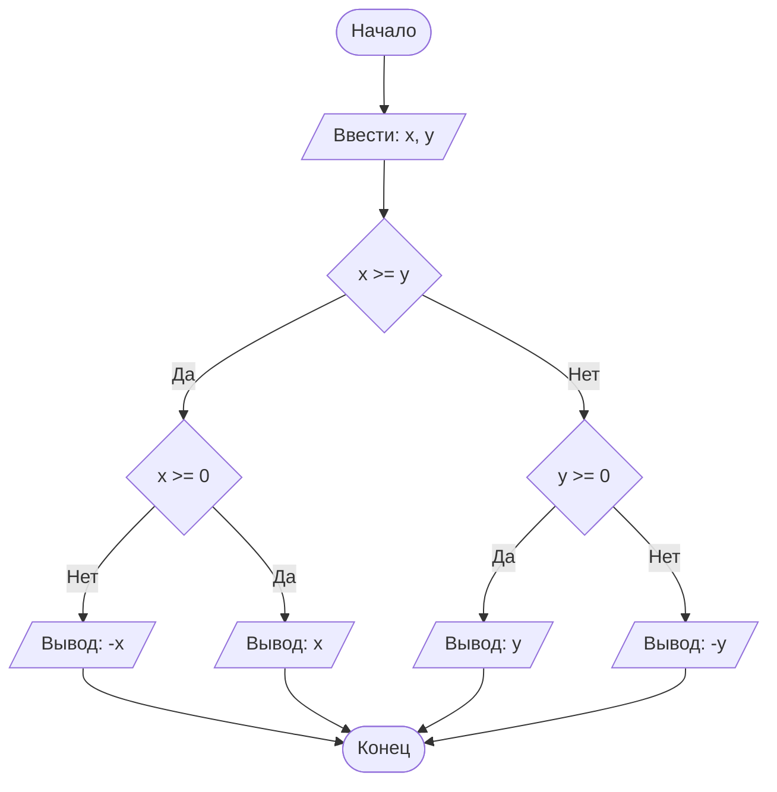

## Cодержание

## Отчет по лабораторной работе № 1

#### № группы: `ПМ-2502`

#### Выполнил: `Янцеловский Виталий Станиславович`

#### Вариант: `25`

### Cодержание:

- [Постановка задачи](#1-постановка-задачи)
- [Входные и выходные данные](#2-входные-и-выходные-данные)
- [Математическая модель](#25-математическая-модель)
- [Выбор структуры данных](#3-выбор-структуры-данных)
- [Алгоритм](#4-алгоритм)
- [Программа](#5-программа)
- [Анализ правильности решения](#6-анализ-правильности-решения)
### 1. Постановка задачи

> Набор из пяти доминошек высоты X устанавливают на расстоянии A, B,
C, D друг от друга в указанном порядке. После этого крайнюю доминошку
роняют в направлении других доминошек. Какое количество доминошек
упадет в результате? Считать, что доминошки имеют нулевую толщину и
что доминошка упадет, если её коснётся предыдущая. На вход программы
подаются натуральные числа X, A, B, C, D

Данную задачу можно разделить на 1 подзадачу.

- Данная задача представляет собой вероятность того, что упадут доминошки в количестве от 1 до 5.
Так как высота одинаковая, то необходимо сравнивать высоту доминошки с расстоянием между каждыми доминошками.
Поэтому Нужно рассмотреть два варианта событий:

    1. `X >= D` #высота>=расстоянию между доминошками, в этом случае домино коснется близ лежащую доминошку, упадет уже 2 доминошки и продолжаем рассматривать остальные случаи падения
    2. `X < D` (отрицание 1 случая) #толщина<S между домино, упадет только 1 доминошка и не расссматриваем больше вариантов решения задачи

Всего надо рассмотреть `1+1+1+1+1 = 5` случаев.

### 2. Входные и выходные данные

#### Данные на вход

На вход программа должна получать 2 числа, при этом в условии не сказано, к какому множеству
принадлежать получаемые числа, поэтому будем считать их вещественными. Также даны верхняя и нижняя границы получаемых
чисел.

|             | Тип                | min значение    | max значение   |
|-------------|--------------------|-----------------|----------------|
| X (Число 1) | Вещественное число | 10<sup>9</sup>  | 10<sup>9</sup> |
| Y (Число 2) | Вещественное число | -10<sup>9</sup> | 10<sup>9</sup> |

#### Данные на выход

Т.к. программа должна вывести модуль максимального из получаемых чисел, то на выход мы получим
единственное вещественное неотрицательное число, не превышающее 10<sup>9</sup>.

|         | Тип                                | min значение | max значение   |
|---------|------------------------------------|--------------|----------------|
| Число 1 | Вещественное неотрицательное число | 0            | 10<sup>9</sup> |

### 3. Выбор структуры данных

Программа получает 2 вещественных числа, не превышающих по модулю 10<sup>9</sup> < 2<sup>30</sup>. Поэтому для их хранения
можно выделить 2 переменных (`x` и `y`) типа `double`.

|             | название переменной | Тип (в Java) | 
|-------------|---------------------|--------------|
| X (Число 1) | `x`                 | `double`     |
| Y (Число 2) | `y`                 | `double`     | 

Для вывода результата необязательно его хранить в отдельной переменной.

### 4. Алгоритм

#### Алгоритм выполнения программы:

1. **Ввод данных:**  
   Программа считывает два вещественных числа, обозначенные как `x` и `y`.

2. **Сравнение чисел:**  
   Программа сравнивает значения `x` и `y`. Если `x` больше или равно `y`, программа переходит к следующему шагу для
   работы с `x`. Если `y` больше, программа выполняет действия для работы с `y`.

3. **Проверка знака для выбранного числа:**
    - Если было выбрано число `x` (так как оно больше или равно `y`), проверяется, положительное оно или отрицательное.
      Если `x` положительное, оно выводится на экран. Если отрицательное, выводится его модуль (т.е. противоположное
      по знаку значение).
    - Если было выбрано число `y` (поскольку оно больше `x`), выполняется аналогичная проверка. Если `y` положительное,
      оно выводится на экран. Если отрицательное, выводится его модуль.

4. **Вывод результата:**  
   На экран выводится либо большее из чисел, либо его модуль, если это число отрицательное.

#### Блок-схема



### 5. Программа

```java
import java.io.PrintStream;
import java.util.Scanner;

public class Main {
    // Объявляем объект класса Scanner для ввода данных
    public static Scanner in = new Scanner(System.in);
    // Объявляем объект класса PrintStream для вывода данных
    public static PrintStream out = System.out;

    public static void main(String[] args) {
        // Считывание двух вещественных чисел x и y из консоли
        double x = in.nextDouble();
        double y = in.nextDouble();

        // Определение максимального числа
        if (x >= y) {
            // Если x положительное, выводим x, иначе выводим -x,
            // чтобы на выходе было его абсолютное значение
            if (x >= 0) {
                out.println(x);
            } else {
                out.println(-x);
            }
        } else {
            // Если x положительное, выводим y, иначе выводим -y,
            // чтобы на выходе было его абсолютное значение
            if (y >= 0) {
                out.println(y);
            } else {
                out.println(-y);
            }
        }
    }
}
```

### 6. Анализ правильности решения

Программа работает корректно на всем множестве решений с учетом ограничений.

1. Тест на `X > Y > 0`:

    - **Input**:
        ```
        5 1.3
        ```

    - **Output**:
        ```
        5
        ```

2. Тест на `X < Y < 0`:

    - **Input**:
        ```
        -4 -2.2
        ```

    - **Output**:
        ```
        2.2
        ```

3. Тест на `X < 0 < Y`:

    - **Input**:
        ```
        -4 5
        ```

    - **Output**:
        ```
        5
        ```

4. Тест на `X = 0` или `Y = 0`:

    - **Input**:
        ```
        0 -3
        ```

    - **Output**:
        ```
        3
        ```

5. Тест на ограничение задачи:

    - **Input**:
        ```
        -1000000000 1000000000
         | **0** - **100** |

# Lab1
№ группы: ПМ-2502
Выполнил: Янцеловский Виталий Станиславович
Вариант: 25
Cодержание:
-Постановка задачи
-Входные и выходные данные
-Выбор структуры данных
-Алгоритм
-Программа
-Анализ правильности решения
1. Постановка задачи
Набор из пяти доминошек высоты X устанавливают на расстоянии A, B,
C, D друг от друга в указанном порядке. После этого крайнюю доминошку
роняют в направлении других доминошек. Какое количество доминошек
упадет в результате? Считать, что доминошки имеют нулевую толщину и
что доминошка упадет, если её коснётся предыдущая. На вход программы
подаются натуральные числа X, A, B, C, D

Данная задача представляет собой вероятность того, что упадут доминошки в количестве от 1 до 5.
Так как высота одинаковая, то необходимо сравнивать высоту доминошки с расстоянием между каждыми доминошками.
Поэтому Нужно рассмотреть два варианта событий:
i.X>=D #толщина>=расстоянию между доминошками, в этом случае домино коснется близ лежащую доминошку, упадет уже 2 доминошки и продолжаем рассматривать остальные случаи падения
ii.X<D(отрицание 1 случая) #толщина<S между домино, упадет только 1 доминошка и не расссматриваем больше вариантов решения задачи
Всего нужно рассмотреть 5 случаев

2. Входные и выходные данные
Данные на вход
На вход программа должна получать 5 чисел, все натуральные по условию . Также даны верхняя и нижняя границы получаемых чисел.

Тип	min значение	max значение
X (Число 1)	Натуральное число	1	+∞
A (Число 2)	Натуральное число	1	+∞
B (Число 3)	Натуральное число	1	+∞
C (Число 4)	Натуральное число	1	+∞
D (Число 5)	Натуральное число	1	+∞
Данные на выход
Т.к. программа должна вывести количество упавших домино, то на выход получим натуральное число от 1 до 5.

Тип	min значение	max значение
Число 1	Натуральное число	1	5
3. Выбор структуры данных
Программа получает 2 вещественных числа, не превышающих по модулю 109 < 230. Поэтому для их хранения можно выделить 2 переменных (x и y) типа double.

название переменной	Тип (в Java)
X (Число 1)	x	double
Y (Число 2)	y	double
Для вывода результата необязательно его хранить в отдельной переменной.

4. Алгоритм
Алгоритм выполнения программы:
Ввод данных:
Программа считывает два вещественных числа, обозначенные как x и y.

Сравнение чисел:
Программа сравнивает значения x и y. Если x больше или равно y, программа переходит к следующему шагу для работы с x. Если y больше, программа выполняет действия для работы с y.

Проверка знака для выбранного числа:

Если было выбрано число x (так как оно больше или равно y), проверяется, положительное оно или отрицательное. Если x положительное, оно выводится на экран. Если отрицательное, выводится его модуль (т.е. противоположное по знаку значение).
Если было выбрано число y (поскольку оно больше x), выполняется аналогичная проверка. Если y положительное, оно выводится на экран. Если отрицательное, выводится его модуль.
Вывод результата:
На экран выводится либо большее из чисел, либо его модуль, если это число отрицательное.

Блок-схема

5. Программа
import java.io.PrintStream;
import java.util.Scanner;

public class Main {
    // Объявляем объект класса Scanner для ввода данных
    public static Scanner in = new Scanner(System.in);
    // Объявляем объект класса PrintStream для вывода данных
    public static PrintStream out = System.out;

    public static void main(String[] args) {
        // Считывание двух вещественных чисел x и y из консоли
        double x = in.nextDouble();
        double y = in.nextDouble();

        // Определение максимального числа
        if (x >= y) {
            // Если x положительное, выводим x, иначе выводим -x,
            // чтобы на выходе было его абсолютное значение
            if (x >= 0) {
                out.println(x);
            } else {
                out.println(-x);
            }
        } else {
            // Если x положительное, выводим y, иначе выводим -y,
            // чтобы на выходе было его абсолютное значение
            if (y >= 0) {
                out.println(y);
            } else {
                out.println(-y);
            }
        }
    }
}
6. Анализ правильности решения
Программа работает корректно на всем множестве решений с учетом ограничений.

Тест на X > Y > 0:

Input:

5 1.3
Output:

5
Тест на X < Y < 0:

Input:

-4 -2.2
Output:

2.2
Тест на X < 0 < Y:

Input:

-4 5
Output:

5
Тест на X = 0 или Y = 0:

Input:

0 -3
Output:

3
Тест на ограничение задачи:

Input:

-1000000000 1000000000
Output:

1000000000
