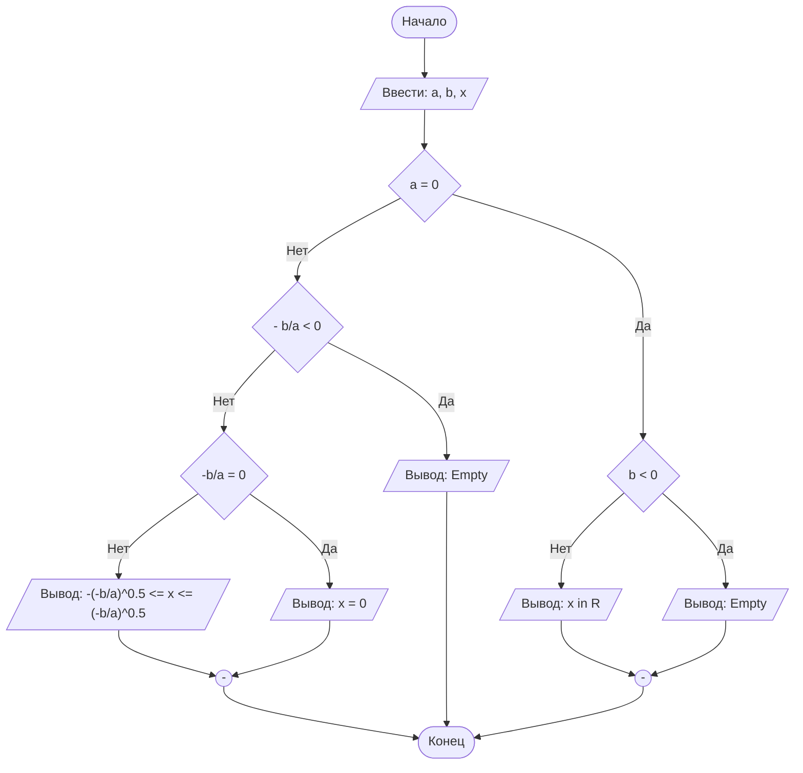

## Cодержание

## Отчет по лабораторной работе № 1

#### № группы: `ПМ-2502`

#### Выполнил: `Янцеловский Виталий Станиславович`

#### Вариант: `25`

### Cодержание:

- [Постановка задачи](#1-постановка-задачи)
- [Входные и выходные данные](#2-входные-и-выходные-данные)
- [Математическая модель](#25-математическая-модель)
- [Выбор структуры данных](#3-выбор-структуры-данных)
- [Алгоритм](#4-алгоритм)
- [Программа](#5-программа)
- [Анализ правильности решения](#6-анализ-правильности-решения)

### 1. Постановка задачи

- Условия задачи

> Набор из пяти доминошек высоты X устанавливают на расстоянии A, B,
C, D друг от друга в указанном порядке. После этого крайнюю доминошку
роняют в направлении других доминошек. Какое количество доминошек
упадет в результате? Считать, что доминошки имеют нулевую толщину и
что доминошка упадет, если её коснётся предыдущая. На вход программы
подаются натуральные числа X, A, B, C, D

Данная задача представляет собой вероятность того, что упадут доминошки в количестве от 1 до 5.
Так как толщина одинаковая, то необходимо сравнивать толщину доминошки с расстоянием каждой доминошки.
Поэтому Нужно рассмотреть два варианта событий:
i.X>=D #толщина>=расстоянию между доминошками, в этом случае домино коснется близ лежащую доминошку, упадет уже 2 доминошки и продолжаем рассматривать остальные случаи падения
ii.X<D(отрицание 1 случая) #толщина<S между домино, упадет только 1 доминошка и не расссматриваем больше вариантов решения задачи
Всего нужно рассмотреть 5 случаев


### 2. Входные и выходные данные

Уточните, что подается на вход (с обоснованием/рассуждением):

- какие типы данных (целые/вещественные числа/символы/строки);
- в каком количестве каждое (ограничение сверху/снизу);
- диапазон значений (min и max возможные значения);

Это про каждые входные данные. Затем - то же самое про выходные.

### 2,5. Математическая модель

Если нужно.

### 3. Выбор структуры данных

Анализ (рассуждения) и обоснования того, где и как Вы собираетесь хранить всё то,
что нужно для работы программы.

### 4. Алгоритм

На русском языке подробно расписать, что и в каком порядке делает Ваша программа.

В 1 лабораторной работе блок-схем обязательна. Ниже представлен пример с лекции,
реализованный с помощью `mermaid` - инструментом для рисования диаграмм и блок-схем.

```markdown
    ```mermaid
        ([Начало]) --> B[/Ввести: a, b, x/]
        B --> C{a = 0}
        C -- Нет --> D{- b/a < 0}
        D -- Нет --> E{"-b/a = 0"}
        E -- Нет --> F[/"Вывод: -(-b/a)^0.5 <= x <= (-b/a)^0.5"/]
        E -- Да --> G[/Вывод: x = 0/]
        D -- Да --> H[/Вывод: Empty/]
        C -- Да --> I{b < 0}
        I -- Нет --> J[/Вывод: x in R/]
        I -- Да --> K[/Вывод: Empty/]
        J --> M(("-"))
        K --> M
        G --> L(("-"))
        H ----> Z
        F --> L
        M --> Z
        L --> Z([Конец])
    ``` 
```




`Mermaid` нативно интегрирован в `GitHub`, а для работы в Вашей среде разработке - нужно установить
плагин: `File` > `Settings` > `Plugins`.


### 5. Программа

Полный текст программы с комментариями на русском языке

Нужно вставить код прямо в отчет в блок:

```markdown
    ```java
        class Main{
            // Что-то далее
        }
    ``` 
```

Это будет выглядеть следующим образом:

```java
class Main{
    // Что-то далее
}
```

### 6. Анализ правильности решения

Привести тесты и анализ работы программы для этих тестов.
Очень неплохо было бы обосновать выбор тестов.

1. Тест на что-то

- Input:
    ```
    1
    1
    ```

- Output:
    ```
    2
    ```

2. Тест на что-то еще

- Input:
    ```
    1
    -1
    ```

- Output:
    ```
    0
    ```

# Критерии оценивания

Обратите внимание на то, что лабораторная работа должна быть выложена в отдельный репозиторий с названием LabN (N -
Номер лабы). В репозитории должно быть минимум 2 файла (README.md - отчет, Main.java - код лабы)

| **Критерий**                                                                                                                                                                           | **Баллы**       |
|----------------------------------------------------------------------------------------------------------------------------------------------------------------------------------------|-----------------|
| **Корректность программы**                                                                                                                                                             | **0** - **40**  |
| - Программа полностью выполняет задачу                                                                                                                                                 | 15              |
| - Нет ошибок выполнения                                                                                                                                                                | 10              |
| - Учтены все ограничения                                                                                                                                                               | 5               |
| - Правильное поведение в "крайних" случаях                                                                                                                                             | 10              |
|                                                                                                                                                                                        |                 |
| **Оптимизация кода**                                                                                                                                                                   | **0** - **20**  |
| - Эффективные алгоритмы                                                                                                                                                                | 10              |
| - Избежание избыточности и повторов                                                                                                                                                    | 5               |
| - Разумность использования структур данных                                                                                                                                             | 5               |
|                                                                                                                                                                                        |                 |
| **Читабельность и стиль кода**                                                                                                                                                         | **0** - **20**  |
| - Соблюдение стандартов форматирования                                                                                                                                                 | 5               |
| - Наличие комментариев, в полном объеме поясняющих написанный код                                                                                                                      | 10              |
| - Понятные имена переменных и функций                                                                                                                                                  | 5               |
|                                                                                                                                                                                        |                 |
| **Оформление отчета**                                                                                                                                                                  | **0** - **20**  |
| - Соблюдение структуры отчета                                                                                                                                                          | 5               |
| - Отчет загружен на GitHub в репозиторий с названием LabN (N - номер лабораторной работы), отчет в формате Markdown с названием README.md, также есть файл Main.java с кодом программы | Обязательно     |
| - Четкое описание алгоритма (блок-схема если нужна)                                                                                                                                    | 5               |
| - Полнота покрытия тестами всех случаев                                                                                                                                                | 5               |
| - Обоснования использования алгоритма, структур данных                                                                                                                                 | 5               |
|                                                                                                                                                                                        |                 |
| **Общая сумма**                                                                                                                                                                        | **0** - **100** |

# Lab1
№ группы: ПМ-2502
Выполнил: Янцеловский Виталий Станиславович
Вариант: 25
Cодержание:
-Постановка задачи
-Входные и выходные данные
-Выбор структуры данных
-Алгоритм
-Программа
-Анализ правильности решения
1. Постановка задачи
Набор из пяти доминошек высоты X устанавливают на расстоянии A, B,
C, D друг от друга в указанном порядке. После этого крайнюю доминошку
роняют в направлении других доминошек. Какое количество доминошек
упадет в результате? Считать, что доминошки имеют нулевую толщину и
что доминошка упадет, если её коснётся предыдущая. На вход программы
подаются натуральные числа X, A, B, C, D

Данная задача представляет собой вероятность того, что упадут доминошки в количестве от 1 до 5.
Так как толщина одинаковая, то необходимо сравнивать толщину доминошки с расстоянием каждой доминошки.
Поэтому Нужно рассмотреть два варианта событий:
i.X>=D #толщина>=расстоянию между доминошками, в этом случае домино коснется близ лежащую доминошку, упадет уже 2 доминошки и продолжаем рассматривать остальные случаи падения
ii.X<D(отрицание 1 случая) #толщина<S между домино, упадет только 1 доминошка и не расссматриваем больше вариантов решения задачи
Всего нужно рассмотреть 5 случаев

2. Входные и выходные данные
Данные на вход
На вход программа должна получать 5 чисел, все натуральные по условию . Также даны верхняя и нижняя границы получаемых чисел.

Тип	min значение	max значение
X (Число 1)	Натуральное число	1	+∞
A (Число 2)	Натуральное число	1	+∞
B (Число 3)	Натуральное число	1	+∞
C (Число 4)	Натуральное число	1	+∞
D (Число 5)	Натуральное число	1	+∞
Данные на выход
Т.к. программа должна вывести количество упавших домино, то на выход получим натуральное число от 1 до 5.

Тип	min значение	max значение
Число 1	Натуральное число	1	5
3. Выбор структуры данных
Программа получает 2 вещественных числа, не превышающих по модулю 109 < 230. Поэтому для их хранения можно выделить 2 переменных (x и y) типа double.

название переменной	Тип (в Java)
X (Число 1)	x	double
Y (Число 2)	y	double
Для вывода результата необязательно его хранить в отдельной переменной.

4. Алгоритм
Алгоритм выполнения программы:
Ввод данных:
Программа считывает два вещественных числа, обозначенные как x и y.

Сравнение чисел:
Программа сравнивает значения x и y. Если x больше или равно y, программа переходит к следующему шагу для работы с x. Если y больше, программа выполняет действия для работы с y.

Проверка знака для выбранного числа:

Если было выбрано число x (так как оно больше или равно y), проверяется, положительное оно или отрицательное. Если x положительное, оно выводится на экран. Если отрицательное, выводится его модуль (т.е. противоположное по знаку значение).
Если было выбрано число y (поскольку оно больше x), выполняется аналогичная проверка. Если y положительное, оно выводится на экран. Если отрицательное, выводится его модуль.
Вывод результата:
На экран выводится либо большее из чисел, либо его модуль, если это число отрицательное.

Блок-схема

5. Программа
import java.io.PrintStream;
import java.util.Scanner;

public class Main {
    // Объявляем объект класса Scanner для ввода данных
    public static Scanner in = new Scanner(System.in);
    // Объявляем объект класса PrintStream для вывода данных
    public static PrintStream out = System.out;

    public static void main(String[] args) {
        // Считывание двух вещественных чисел x и y из консоли
        double x = in.nextDouble();
        double y = in.nextDouble();

        // Определение максимального числа
        if (x >= y) {
            // Если x положительное, выводим x, иначе выводим -x,
            // чтобы на выходе было его абсолютное значение
            if (x >= 0) {
                out.println(x);
            } else {
                out.println(-x);
            }
        } else {
            // Если x положительное, выводим y, иначе выводим -y,
            // чтобы на выходе было его абсолютное значение
            if (y >= 0) {
                out.println(y);
            } else {
                out.println(-y);
            }
        }
    }
}
6. Анализ правильности решения
Программа работает корректно на всем множестве решений с учетом ограничений.

Тест на X > Y > 0:

Input:

5 1.3
Output:

5
Тест на X < Y < 0:

Input:

-4 -2.2
Output:

2.2
Тест на X < 0 < Y:

Input:

-4 5
Output:

5
Тест на X = 0 или Y = 0:

Input:

0 -3
Output:

3
Тест на ограничение задачи:

Input:

-1000000000 1000000000
Output:

1000000000
